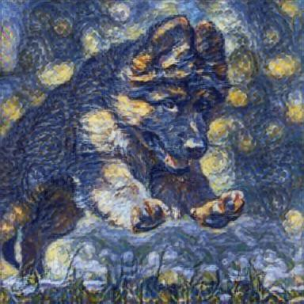
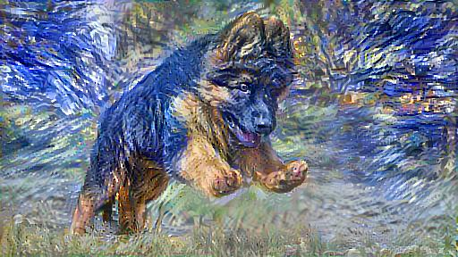

# ComputerVisionFinal

Bergen Allison \
CS295: Computer Vision \
May 11th, 2021 \
Final Project Option 2 

##Description

For my final project, I chose to create a neural style transfer program that is able to extract the style of one image, and combine it with the content from another in order to create a new image. Whereas a naïve approach might include overlapping the images, this would most likely create sloppy and unsatisfactory results. Neural style transfer improves upon this by using a CNN and neural representations to separate and then recombine the content and style from the provided images. 

I implemented two files, which perform the neural style transfer in different ways. The fast_style_transfer.py file connects to a pre-trained, generalized model from tensorflow-hub, and uses this model to quickly perform the style transfer. As noted in the file name, this file usually executes within a few seconds, although this can be dependent on your internet connection, and the status of the web server the model if held on. Additionally, the first time you access the model there is a medium sized download that must occur, so the very first run will not be as fast as the proceeding ones. 

The second file I implemented for neural style transfer is slow_style_transfer.py, which like the title suggests performs style transfer but at a slower pace than the previous file. This is because rather than downloading a pre-trained model online, this file builds up the model itself, and requires a significant amount of time to run. Running this file can be extremely slow if tensorflow is installed without GPU capabilities, or if a GPU is unavailable, since CPUs are not optimized for deep learning. 

In my opinion, the results from the slow style transfer look better, which is likely due to the fact that you are building up the model specifically based on the content and style images you provided. The fast style transfer uses a very general model that works with many styles, but it not optimized for any single style in particular. Since it is time consuming to run this code, I have included sample outputs into the outputs directory from both the slow style transfer and the fast style transfer. The samples from the slow style transfer were created with 10 epochs and 100 steps per epoch, however this required 20-30 minutes to complete, so unless you have tensorflow with a GPU I would recommend testing with a smaller number of epochs and steps per epoch.

##Package Requirements

To run the programs, you need all of the following packages installed:

os\
tensorflow\
tensorflow_hub\
ssl\
matplotlib\
numpy\
PIL.Image\
time\
functools\
argparse

##Running the Code

The code is implemented in similar style to that of the search engine question from homework three. To run either of the files, you must enter a command line prompt that tells the program the location of the content image and the location of the style image. Additionally, for the slow style transfer, you must specify the number of epochs and steps per epoch for training. Sample images are provided for content images and style images, and you can include your own images if you would like to test with them. I recommend including images with a .jpg extension, as .png extension images can raise errors in the code. The resulting image will also be saved in the outputs directory, if you are running slow style transfer only the final result will be stored, not the intermediate results that are shown. Examples for running are shown below.

Example: to run fast style transfer with the German Shepherd puppy sample content image and the Starry Night sample style image, this is the command line prompt and the result:

python fast_style_transfer.py --content content-images/GSD-Puppy.jpg --style style-images/Starry-Night.jpg

Example: to run slow style transfer with the German Shepherd puppy sample content image and the Starry Night sample style image with 10 epochs and 100 steps per epoch, this is the command line prompt and the result:

python slow_style_transfer.py --content content-images/UVM.jpg --style style-images/Jackson-Polluck.jpg --epochs 10 --steps 100

##References

Background information:\
https://towardsdatascience.com/neural-style-transfer-tutorial-part-1-f5cd3315fa7f\

Code:\
https://www.tensorflow.org/tutorials/generative/style_transfer\
https://www.tensorflow.org/hub/tutorials/tf2_arbitrary_image_stylization\

Content Images:\
https://www.theguardian.com/us-news/2020/aug/14/eagle-drone-attack-lake-michigan\
https://vermontbiz.com/news/2020/july/13/uvm-go-test-optional-students-applying-2020-21\
https://readysetpuppy.com/dos-and-donts-of-exercising-a-young-german-shepherd/\

Style Images:\
https://en.wikipedia.org/wiki/Guernica_(Picasso)\
https://www.theguardian.com/artanddesign/2015/jun/19/why-jackson-pollock-painting\
https://www.overstockart.com/painting/water-lilies-claude-monet\
https://www.vangoghgallery.com/painting/starry-night.html\

